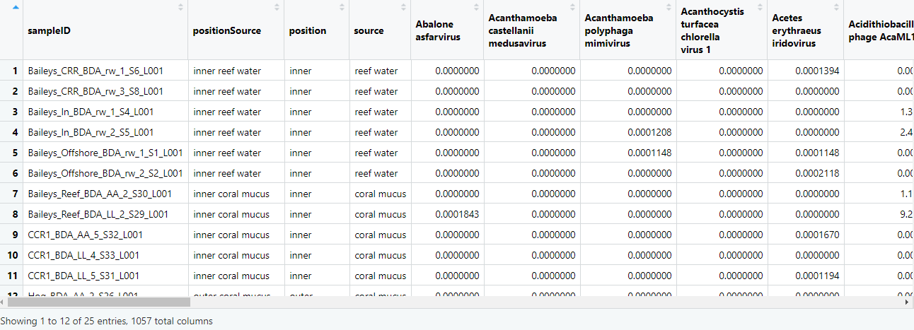
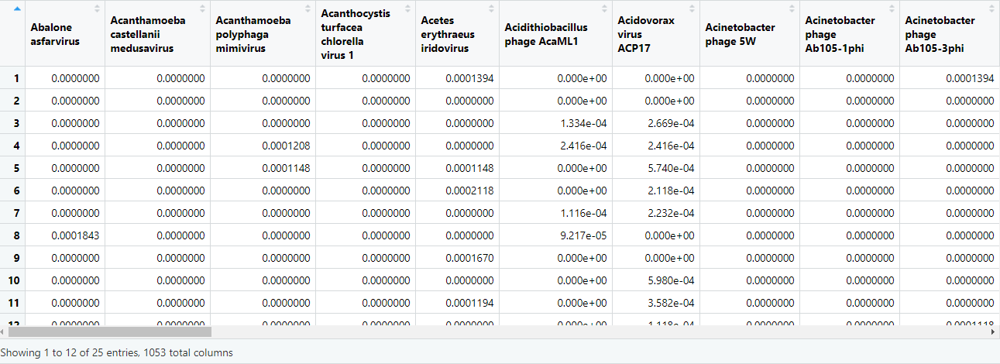
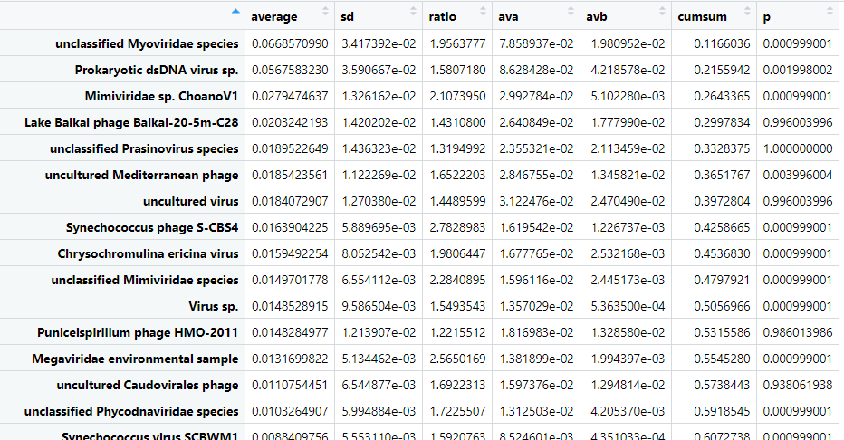
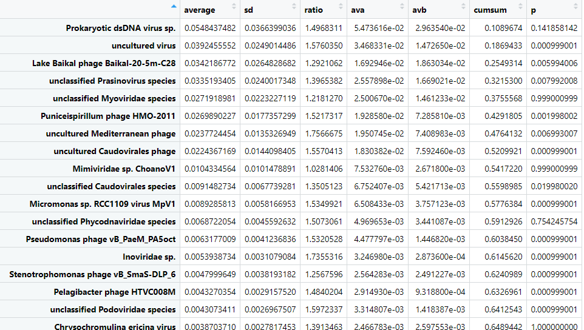
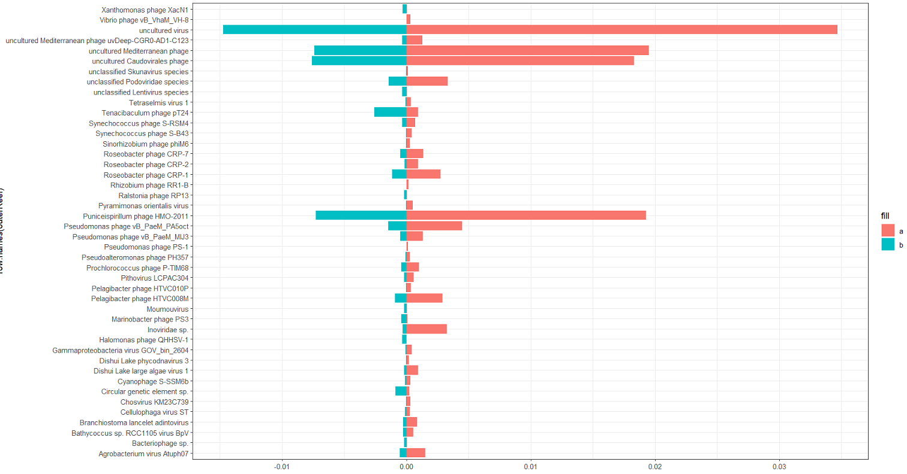
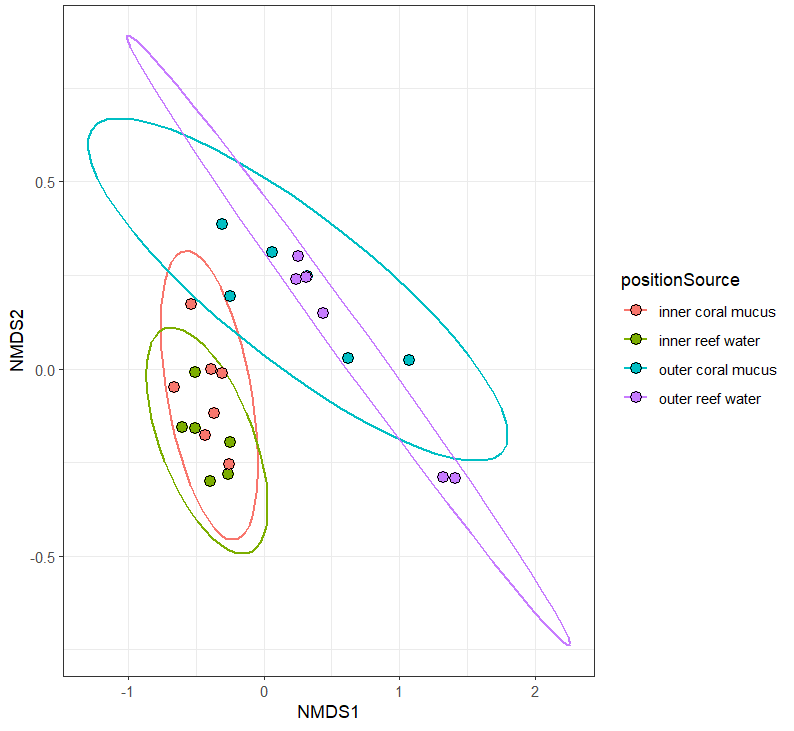
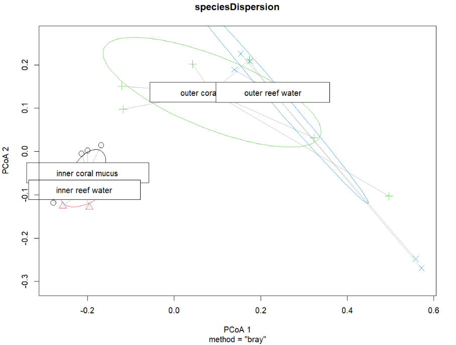
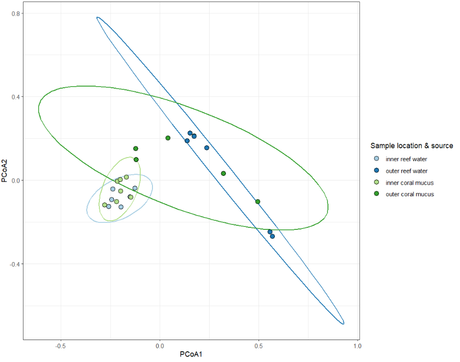

# Viral ecology

To understanding the global trends of all viral species across samples we apply ecological models rather than pairwise tests.
In this section, we will learn about viral ecology using the Coral dataset from the Hecatomb manuscript.
This dataset consists of regular WGS metagenome sequencing samples of coral mucus and the surrounding reef water,
from two different reef locations.

__Coral dataset samples__

|                   | __inner reef__    | __outer reef__    |
| ---               | ---               | ---               |
| __reef water__    | 6                 | 6                 |
| __coral mucus__   | 7                 | 6                 |

## Download the dataset

We ran these samples with Hecatomb using `--search fast` and otherwise default parameters.
We then filtered to only consider amino acid hits that are assigned using the LCA algorithm, 
(`filter(taxMethod=='LCA', alnType=='aa')`) as this usually removes almost all false positive hits.
Download the ready-to-analysed dataset:

- [coral.bigtable.filtered.csv.gz](https://cloudstor.aarnet.edu.au/plus/s/g3HiH5CXUBrgg9J/download)
- [meta.coral.csv](https://cloudstor.aarnet.edu.au/plus/s/dhOjeSGL04tKC36/download)

Read in the data and merge the metadata with the bigtable.

```r
data = read.csv('coral.bigtable.filtered.csv.gz', header=T)
meta = read.csv('meta.coral.csv', header=T)
data = merge(data, meta, by = 'sampleID')
```

## Species abundance matrix

Before we can apply any models, we need to generate an abundance matrix for all samples by all species (or genera, 
families etc).
We will create one matrix that includes the metadata, and a second of only the sum of the normalised counts (percent).
We will use these tables for all subsequent analyses.

```r
# collect counts -> matrix + metadata
speciesCounts = data %>%
  group_by(sampleID,positionSource,position,source,species) %>%
  summarise(n=sum(percent)) %>%
  spread(species,n,fill=0)

View(speciesCounts)
```

[](img/tuteCoralSpTbl.png)

```r
# just the count matrix
speciesMtx = as.matrix(speciesCounts[,5:ncol(speciesCounts)])

View(speciesMtx)
```

[](img/tuteCoralSpMtx.png)

## PERMANOVA

If we want to see if the viromes of our samples are significantly different between say inner reef samples and outer 
reef samples, we could apply a PERMANOVA.
We have two columns of metadata (reef location and sample type) and hence several combinations that we can look at.

```r
# reef position
adonis2(speciesMtx ~ position, data = speciesCounts, permutations = 1000, method="bray", by=NULL)
```

```text
Permutation test for adonis under reduced model
Permutation: free
Number of permutations: 1000

adonis2(formula = speciesMtx ~ position, data = speciesCounts, permutations = 1000, method = "bray", by = NULL)
         Df SumOfSqs      R2      F   Pr(>F)    
Model     1   1.2375 0.39347 14.921 0.000999 ***
Residual 23   1.9077 0.60653                    
Total    24   3.1452 1.00000                    
---
Signif. codes:  0 ‘***’ 0.001 ‘**’ 0.01 ‘*’ 0.05 ‘.’ 0.1 ‘ ’ 1
```

```r
# sample type
adonis2(speciesMtx ~ source, data = speciesCounts, permutations = 1000, method="bray",by=NULL)
```

```text
         Df SumOfSqs      R2      F   Pr(>F)   
Model     1  0.20195 0.06421 1.5781 0.1568
Residual 23  2.94323 0.93579              
Total    24  3.14518 1.00000  

```

```r
# both
adonis2(speciesMtx ~ positionSource, data = speciesCounts, permutations = 1000, method="bray",by=NULL)
```

```text
         Df SumOfSqs      R2      F   Pr(>F)   
Model     3   1.5155 0.48184 6.5094 0.000999 ***
Residual 21   1.6297 0.51816                    
Total    24   3.1452 1.00000  
```

## SIMPER

You should find that sample viromes are significantly different between samples based on position, 
as well as position and sample source, but not by sample source alone.
We can follow this up with a SIMPER to find what viral species are driving these differences.

```r
# position
speciesSourceSimper = with(speciesCounts, simper(speciesMtx, position, permutations = 1000))
speciesPositionSum = summary(speciesSourceSimper, ordered = T)
View(speciesPositionSum$inner_outer)
```

[](img/tuteInnOutPos.png)

```r
# position x source
speciesPositionSimper = with(speciesCounts, simper(speciesMtx, positionSource, permutations = 1000))
speciesPosSource = summary(speciesPositionSimper, ordered = T)
View(speciesPosSource$`outer coral mucus_outer reef water`)
```

[](img/tuteOutMucusWater.png)

It can be helpful to visualise the differences.
Let's plot the cumulative sums for outer coral mucus versus outer reef water.
Note we plot the negative of the "B" column.

```r
# pull the data frame
outerReef = as.data.frame(speciesPosSource$`outer coral mucus_outer reef water`)

# filter for significant cummulative sums totalling 90% of variance
outerReef = outerReef %>% 
  filter(p<=0.05, cumsum < 0.9)

# plot
ggplot(outerReef) +
  geom_bar(aes(x=row.names(outerReef), y=ava, fill='a'), stat='identity') +
  geom_bar(aes(x=row.names(outerReef), y=-avb, fill='b'), stat='identity') +
  coord_flip() +
  theme_bw()
```

[](img/tuteCoralSimper.png)

## NMDS

You will probably want to do some sort of multi-dimensional scaling. 
This is useful for taking a large multi-dimensional dataset, such as our viral species counts,
and condensing it down to a two-dimensional representation.
One method is to use the metaMDS function in vegan to generate an NMDS.

```r
# calculate the NMDS from the count matrix
speciesNmds = metaMDS(speciesMtx, distance = 'bray', k = 5, try = 20, trymax = 10000)

# pull the dataframe for plotting
speciesScores = as.data.frame(scores(speciesNmds)$sites)

# add the metada back in (speciesMtx contains the counts only)
speciesScores$positionSource = speciesCounts$positionSource

# plot
ggplot(speciesScores, aes(x=NMDS1,y=NMDS2, color=positionSource, fill=positionSource))+
  stat_ellipse(size=0.75)+
  geom_point(shape=21, color='black', size=3)+
  theme_bw()
```



## PCoA

Another MDS method is to perform a principle components analysis. 
Manually calculate the distance matrix from the viral species count matrix.

```r
speciesDist = vegdist(speciesMtx, method = 'bray')

View(speciesDist)
```

Calculate the multivariate dispersions for the position x source, and test for homogeneity.

```r
speciesDispersion = betadisper(speciesDist,group = speciesScores$positionSource)

permutest(speciesDispersion)
```

```text
Permutation test for homogeneity of multivariate dispersions
Permutation: free
Number of permutations: 999

Response: Distances
          Df  Sum Sq  Mean Sq      F N.Perm Pr(>F)  
Groups     3 0.12731 0.042437 2.9312    999  0.055 .
Residuals 21 0.30403 0.014478                       
---
Signif. codes:  0 ‘***’ 0.001 ‘**’ 0.01 ‘*’ 0.05 ‘.’ 0.1 ‘ ’ 1
```

It's significant-ish.
Plot the principle coordinates.

```r
plot(speciesDispersion, hull=F, ellipse=T, cex=1.5)
```



This works fine, but the plot is a bit ugly.
You can extract the vectors from this object (sample coordinates) and re-plot with ggplot2.

```r
# pull the coordinates
dispVec = as.data.frame(speciesDispersion$vectors)

# add the sample metadata back in
dispVec$positionSource = speciesScores$positionSource

# reorder the samples - not necessary but for these samples it works better for the paired color palette
dispVec$positionSource = factor(
  dispVec$positionSource,
  levels=c('inner reef water',
           'outer reef water',
           'inner coral mucus', 
           'outer coral mucus'))

# plot!
ggplot(dispVec,aes(x=PCoA1,y=PCoA2,color=positionSource,fill=positionSource))+
  stat_ellipse(size=0.75, show.legend = F)+
  geom_point(shape=21,size=3,color='black')+
  scale_color_brewer(palette = 'Paired') +
  scale_fill_brewer(palette = 'Paired')+
  theme_bw()+
  guides(fill=guide_legend(title="Sample location & source"))
```


